# Introdução

Informações básicas do projeto.

* **Projeto:** Tempo otimizado
* **Repositório GitHub:** [ti-1-ppl-cc-m-2024-2-g5-dificuldade-em-otimizacao-do-tempo](https://github.com/ICEI-PUC-Minas-PPLCC-TI/ti-1-ppl-cc-m-2024-2-g5-dificuldade-em-otimizacao-do-tempo)
* **Membros da equipe:**

  * [Dalton Henrique](https://github.com/DALTONHG)
  * [Lucas do Amaral Rodrigues](https://github.com/LAR97)
  * [Vitor de Freitas Rios](https://github.com/Vitorfrios)

A documentação do projeto é estruturada da seguinte forma:

1. Introdução
2. Contexto
3. Product Discovery
4. Product Design
5. Metodologia
6. Solução

✅ [Documentação de Design Thinking (MIRO)](files/processo-dt-G5.pdf)

# Contexto

Muitas pessoas enfrentam dificuldades para otimizar o tempo devido à sobrecarga de tarefas, falta de planejamento e distrações. E nos últimos tempos, isso vem ficando cada vez mais difícil com o quão fácil os dispositivos eletrônicos estão facilmente em nosso alcance, permitindo que nos distraímos. Isso pode causar atrasos na rotina e uma sensação de improdutividade, sendo essencial o uso de métodos para gerenciar e otimizar o tempo, priorizar atividades e alcançar um equilíbrio entre o trabalho e o lazer.

## Problema

 * Dificuldade em gerenciar o tempo: Muitas pessoas enfrentam desafios para organizar suas tarefas e prioridades, levando a perda de produtividade e acúmulo de responsabilidades.
 * Impacto na qualidade de vida: A falta de estratégias eficazes para otimizar o tempo pode resultar em estresse, esgotamento e uma sensação constante de sobrecarga.
 * Dificuldade de acesso a ferramentas: Usuários podem ter dificuldade em encontrar métodos e recursos confiáveis para melhorar sua gestão do tempo de forma prática e acessível.
 * Sobrecarga de responsabilidades: O excesso de tarefas e a falta de organização resultam em longas listas de coisas a fazer, aumentando o tempo necessário para concluir atividades importantes.

## Objetivos

* Facilitar a otimização do tempo:
Nosso projeto visa criar uma plataforma online que ajuda os usuários a organizar e gerenciar melhor seu tempo, conectando-os a ferramentas e estratégias eficazes de produtividade.

* Reduzir as dificuldades no aproveitamento do tempo:
A plataforma oferecerá uma maneira prática e acessível para os usuários identificarem suas prioridades, planejarem suas atividades e alcançarem um equilíbrio entre trabalho e vida pessoal.

* Promover um estilo de vida mais saudável:
Com uma boa gestão de tempo, se reduz a procrastinação, garantindo uma rotina mais ativa e produtiva. Dessa forma, evita-se o estresse, o esgotamento e mantém o aproveitamento do tempo para hobbies e outros interesses.

## Justificativa

* Impacto positivo na produtividade: Ao facilitar o acesso a ferramentas de gestão de tempo, podemos auxiliar os usuários a aumentar sua eficiência, reduzir o estresse e melhorar sua qualidade de vida.

* Redução da procrastinação: De acordo com o artigo [A Ciência da Procrastinação](https://super.abril.com.br/comportamento/a-ciencia-da-procrastinacao), a procrastinação já é um problemma que afeta 20% dos adultos no Brasil. Com uma otimização de tempo, é possível reduzir a procrastinação e promover um estilo de vida mais produtivo, saudável e menos estressante.

* Proximidade: Além disso, todos os integrantes do grupo conseguem se relacionar com a problemática, tendo em vista que todos são estudantes universitários encarregados de diversas atividades e compromissos.

## Público-Alvo

Embora a dificuldade para a otimizar o tempo possa ser um problema que a maioria das pessoas podem enfrentar, o nosso público-alvo acaba se encaixando pelas faixas etárias de jovem-adulto ou adulto (20-50 anos) e que possuem uma rotina cheia e pesada, especialmente aqueles que frequentam espaços escolares, como estudantes, estagiários, professores, coordenadores e outros profissionais.
Muitos deles, possuem acesso à tecnologia, que pode ser um instrumento de trabalho ou também uma das próprias causas do problema. Levando em consideração as diferenças na rotina e na família.
Descreva quais são as pessoas que usarão a sua aplicação indicando os diferentes perfis. A ideia é, dentro do possível, conhecer um pouco mais sobre o perfil dos usuários: conhecimentos prévios, relação com a tecnologia, relações hierárquicas, etc.

Stakeholders:

* Fundamentais: Profissionais e estudantes que precisam organizar suas rotinas.
* Importantes: Indivíduos que buscam melhorar a produtividade.
* Influenciadores: Empresas, educadores, pesquisadores, além de pais e amigos, que apoiam a gestão do tempo.

Personas:

| André Albuquerque               | Aline Maia                                 | Carlos Mendonça                        |
| ------------------------------- | ------------------------------------------ | -------------------------------------- |
| André, um desenvolvedor de software de 19 anos, está lutando para equilibrar seu trabalho e  estudos com sua paixão por jogos  eletrônicos e eSports. Ele busca uma maneira de organizar melhor seu tempo para poder se dedicar aos jogos sem comprometer sua carreira. | Aline, coordenadora de 43 anos, está sobrecarregada com suas responsabilidades profissionais, o que está causando estresse e afetando sua produtividade e vida pessoal. Ela deseja melhorar sua organização para equilibrar suas tarefas profissionais e tempo para relaxar e aproveitar seus hobbies. | Carlos, um professor de 30 anos, enfrenta dificuldades para encontrar tempo para seu hobby de restaurar carros clássicos devido às crescentes responsabilidades no trabalho. Ele quer gerenciar melhor sua agenda para poder se dedicar mais à restauração dos carros sem prejudicar sua carreira.            |

# Product Discovery

## Etapa de Entendimento

* **Matriz CSD e Mapa de Stakeholders**

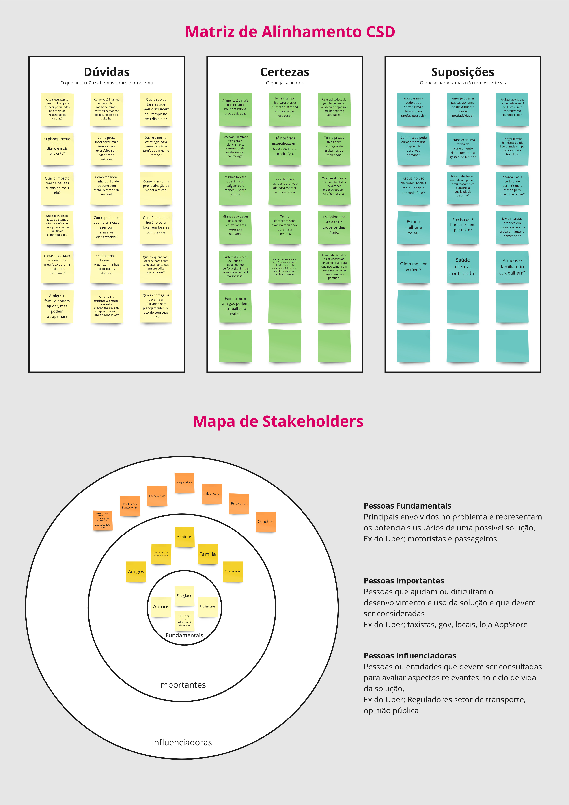

* **Entrevistas Qualitativas e Highlights de Pesquisa**
  

## Etapa de Definição

### Personas

 **André Albuquerque**

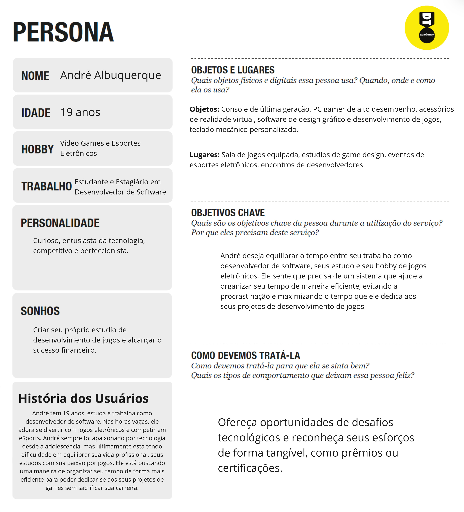

**Aline Maia**

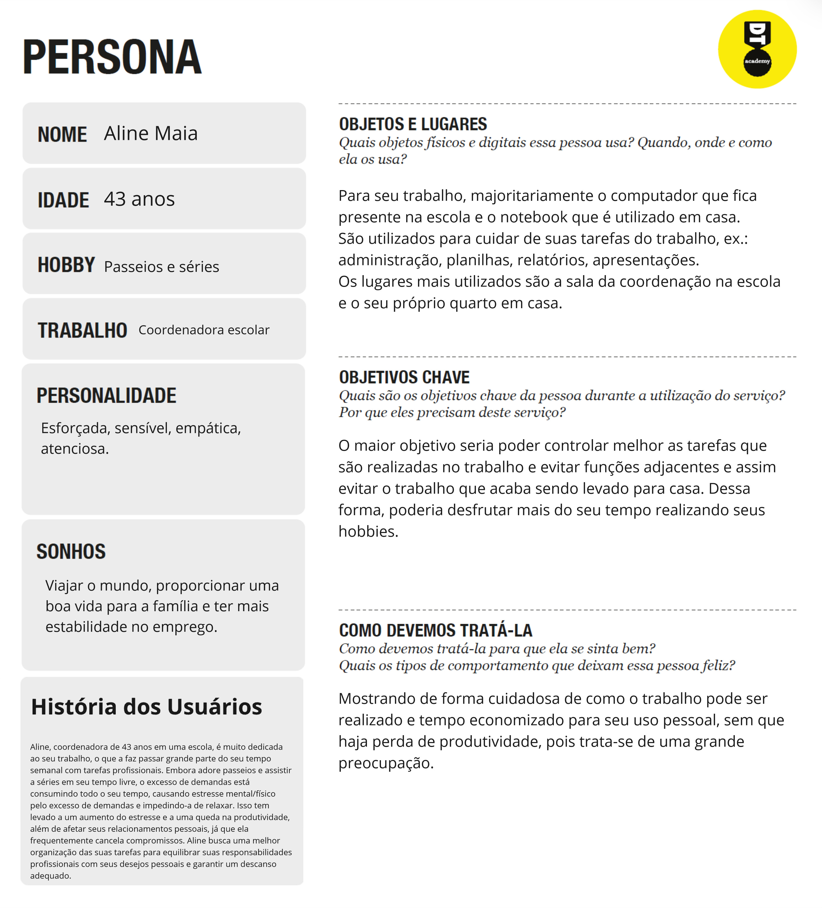

**Carlos Mendonça**

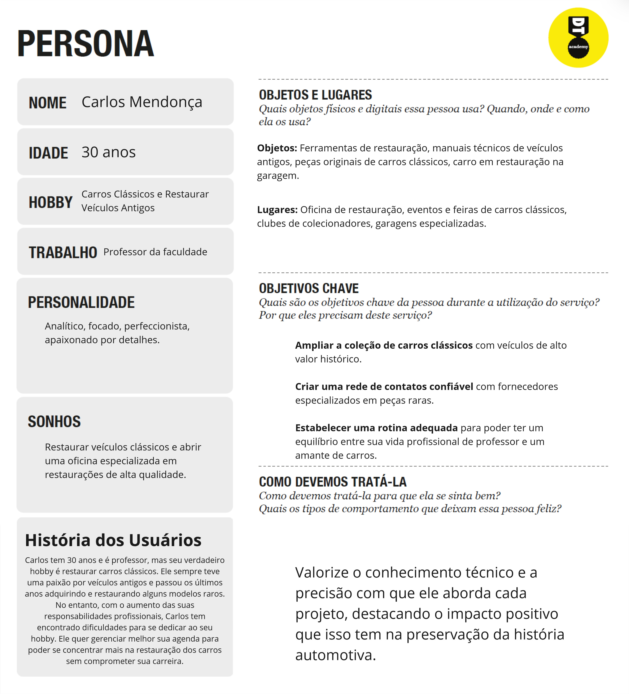

# Product Design

Nesse momento, vamos transformar os insights e validações obtidos em soluções tangíveis e utilizáveis. Essa fase envolve a definição de uma proposta de valor, detalhando a prioridade de cada ideia e a consequente criação de wireframes, mockups e protótipos de alta fidelidade, que detalham a interface e a experiência do usuário.

## Histórias de Usuários

Com base na análise das personas foram identificadas as seguintes histórias de usuários:

| EU COMO...`PERSONA` | QUERO/PRECISO ...`FUNCIONALIDADE`        | PARA ...`MOTIVO/VALOR`               |
| --------------------- | ------------------------------------------ | -------------------------------------- |
| Estudante e Estagiário   | Gerenciar meu tempo | Equilibrar melhor meus estudos, trabalho e hobbies de jogos eletrônicos.             |
| Entusiasta de Jogos         | Uma plataforma para conectar com outros desenvolvedores      | Acelerar o tempo para o compartilhamento de  ideias e projetos |
| Aspirante a ter um próprio estúdio de jogos        | Acesso a recursos e tutoriais para melhorar a administração do tempo      | Melhorar minhas habilidades e alcançar o sucesso financeiro |
| Professor universitário       | Uma ferramenta para organizar melhor minha agenda      | Ter mais tempo para me dedicar aos hobbies sem prejudicar minha carreira acadêmica. |
| Restaurador de carros clássicos         | Organizar meu tempo enquanto pesquiso fornecedores      | Garantir a originalidade e qualidade das minhas restaurações |
| Amante de veículos antigos         | Oportunidades para melhorar minhas técnicas de administração de tempo      | Contribuir para a execução das minhas tarefas diárias e ter mais tempo para o hobby |
| Coordenadora escolar         | Menos demandas adjacentes      | Realizar minha função principal no tempo de trabalho |
| Trabalhadora e mãe         | Definir limites de tarefas diárias      | Evitar trabalho sendo levado para casa |
| Admiradora de passeios com a família         | Organizar o tempo de forma eficiente      | Produzir no trabalho e aproveitar a vida pessoal junto da família |

## Proposta de Valor

 **André Albuquerque**

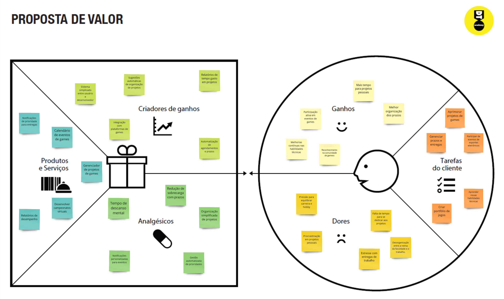

**Aline Maia**

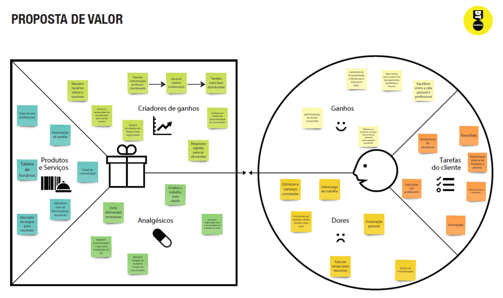

**Carlos Mendonça**

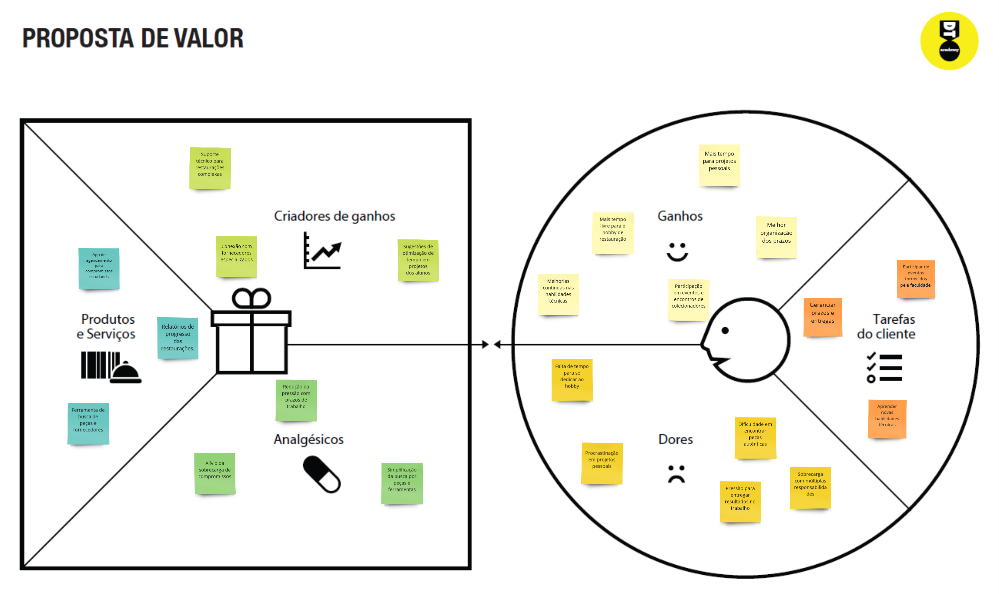

## Requisitos

As tabelas que se seguem apresentam os requisitos funcionais e não funcionais que detalham o escopo do projeto.

## Requisitos Funcionais e Não Funcionais

| *Tela*                               | *Requisitos Funcionais (RF)*                                                                                                                                           | *Requisitos Não Funcionais (RNF)*                                                                                                                                                                              |
|----------------------------------------|--------------------------------------------------------------------------------------------------------------------------------------------------------------------------|------------------------------------------------------------------------------------------------------------------------------------------------------------------------------------------------------------------|
| *1. Tela de Abertura*                | - Exibir o logotipo com animação. - Exibir botão para avançar à tela de cadastro/login ou redirecionar automaticamente após a animação.                                | - Animação com tempo de 2-3 segundos. - Design responsivo. - Transições suaves entre telas.                                                                                                                 |
| *2. Tela de Cadastro/Login*          | - Login com e-mail e senha. - Opção de cadastro para novos usuários. - Links para recuperação de senha e alternar entre cadastro/login. - Login com Google.      | - Segurança dos dados (senhas criptografadas). - Resposta do sistema em < 2 segundos. - Design acessível e legível.                                                                                         |
| *3. Tela de Onboarding*              | - Exibir slides sobre o aplicativo. - Navegar entre slides com botões. - Opção de pular o onboarding. - Registrar se o usuário completou o onboarding.           | - Processo de onboarding em 2-3 minutos. - Textos e gráficos simples e claros. - Compatível com dispositivos móveis e desktops.                                                                             |
| *4. Tela de Dashboard*               | - Exibir tarefas do dia/semana. - Destaque para tarefas urgentes. - Atalhos para “Criar Tarefa”, “Estatísticas” e “Desempenho”. - Atualização em tempo real.      | - Carregamento rápido das tarefas. - Design responsivo. - Suportar grande quantidade de tarefas sem perda de desempenho.                                                                                     |
| *5. Tela de Criação de Tarefas*      | - Formulário para criar/editar tarefas. - Campos obrigatórios: nome, data/hora, prioridade, categoria e notificação. - Salvar tarefa e adicionar ao cronograma.      | - Validação dos campos em tempo real. - Design intuitivo e responsivo. - Salvamento em < 1 segundo.                                                                                                         |
| *6. Tela de Cronograma Diário/Semanal*| - Exibir tarefas organizadas no cronograma. - Permitir arrastar e reorganizar tarefas. - Botão para adicionar nova tarefa.                                           | - Transição rápida e sem travamentos. - Layout responsivo. - Reorganização de tarefas salva imediatamente.                                                                                                   |
| *7. Popup de Sugestões de Otimização*| - Exibir sugestões para otimizar o tempo. - Dicas sobre horários vagos, descanso, estudo. - Permitir aceitar ou ignorar sugestões.                                  | - Popup discreto e não intrusivo. - Design simples e de fácil compreensão. - Sugestões baseadas em análise automática precisa.                                                                               |
| *8. Tela de Análise de Progresso*    | - Exibir gráficos e relatórios sobre tarefas concluídas e tempo por categoria. - Estatísticas diárias, semanais e mensais.                                             | - Gráficos rápidos e interativos. - Layout responsivo. - Informações claras e visualmente atrativas.                                                                                                        |
| *9. Tela de Suporte/Feedback*        | - Formulário para feedback e suporte. - Campos obrigatórios: descrição e categoria. - Envio do formulário e confirmação de recebimento.                              | - Resposta para envio do formulário em < 2 segundos. - Design simples e acessível. - Feedback registrado de forma segura e confidencial.                                                                    |
| *10. Tela de Perfil do Usuário*      | - Exibir informações de perfil. - Permitir edição de informações. - Opções para ajustes de notificação e tema (claro/escuro).                                        | - Alterações salvas em tempo real. - Design responsivo. - Garantia de proteção de dados pessoais com autenticação para mudanças sensíveis.                                                                  |
| *11. Tela de Sugestão*               | - Exibir quatro tipos de sugestões:   1. Ajuda com horários.   2. Dicas para estudo.   3. Descansar/dormir.   4. Dicas para bom desempenho.                   | - Sugestões claras e interativas. - Análise rápida e baseada em dados reais. - Layout compatível com dispositivos móveis e desktops, oferecendo uma experiência fluida.                                       |

## Ações do Usuário

| *Tela*                               | *Ações do Usuário*                                                                                                                                                   |
|----------------------------------------|-----------------------------------------------------------------------------------------------------------------------------------------------------------------------|
| *1. Tela de Abertura*                | - Observar a animação do logotipo. - Clicar no botão para prosseguir, caso não redirecionado automaticamente.                                                      |
| *2. Tela de Cadastro/Login*          | - Inserir e-mail e senha para login. - Clicar na opção de cadastro. - Alternar entre login e cadastro. - Utilizar a opção de login com Google.                |
| *3. Tela de Onboarding*              | - Navegar entre os slides. - Pular o onboarding, se desejado. - Receber informações sobre o aplicativo.                                                         |
| *4. Tela de Dashboard*               | - Visualizar as tarefas do dia/semana. - Interagir com tarefas urgentes. - Usar atalhos para criar tarefas, acessar estatísticas e desempenho.                  |
| *5. Tela de Criação de Tarefas*      | - Completar o formulário (nome, data/hora, prioridade, etc.). - Salvar e adicionar a tarefa ao cronograma.                                                         |
| *6. Tela de Cronograma Diário/Semanal*| - Visualizar tarefas no cronograma. - Reorganizar tarefas arrastando-as. - Adicionar novas tarefas diretamente no cronograma.                                   |
| *7. Tela de Análise de Progresso*    | - Visualizar gráficos e relatórios sobre o progresso. - Navegar entre estatísticas diárias, semanais e mensais.                                                    |
| *8. Tela de Suporte/Feedback*        | - Preencher e enviar o formulário de feedback/suporte. - Aguardar a confirmação de recebimento.                                                                   |
| *9. Tela de Perfil do Usuário*      | - Visualizar informações de perfil. - Editar informações do perfil. - Ajustar preferências de notificação e alternar tema claro/escuro.                         |
| *10. Tela de Sugestão*               | - Visualizar as quatro categorias de sugestões. - Interagir e aplicar as dicas fornecidas.                                                                         |

## Projeto de Interface

Artefatos relacionados com a interface e a interacão do usuário na proposta de solução.

### Wireframes

Estes são os protótipos de telas do sistema.

**Página Inicial**

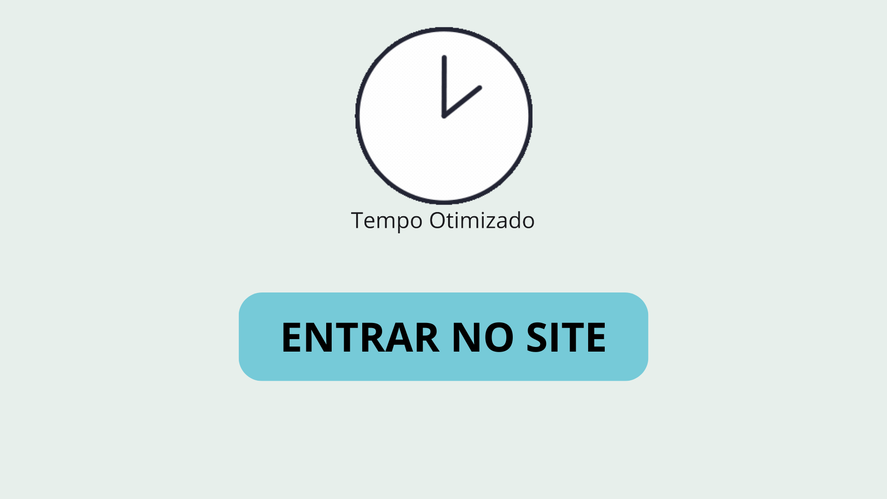

Página inicial da plataforma, onde o usuário poderá ler sobre o projeto e acessar a página de acesso à conta.

**Página de Login e Registro**

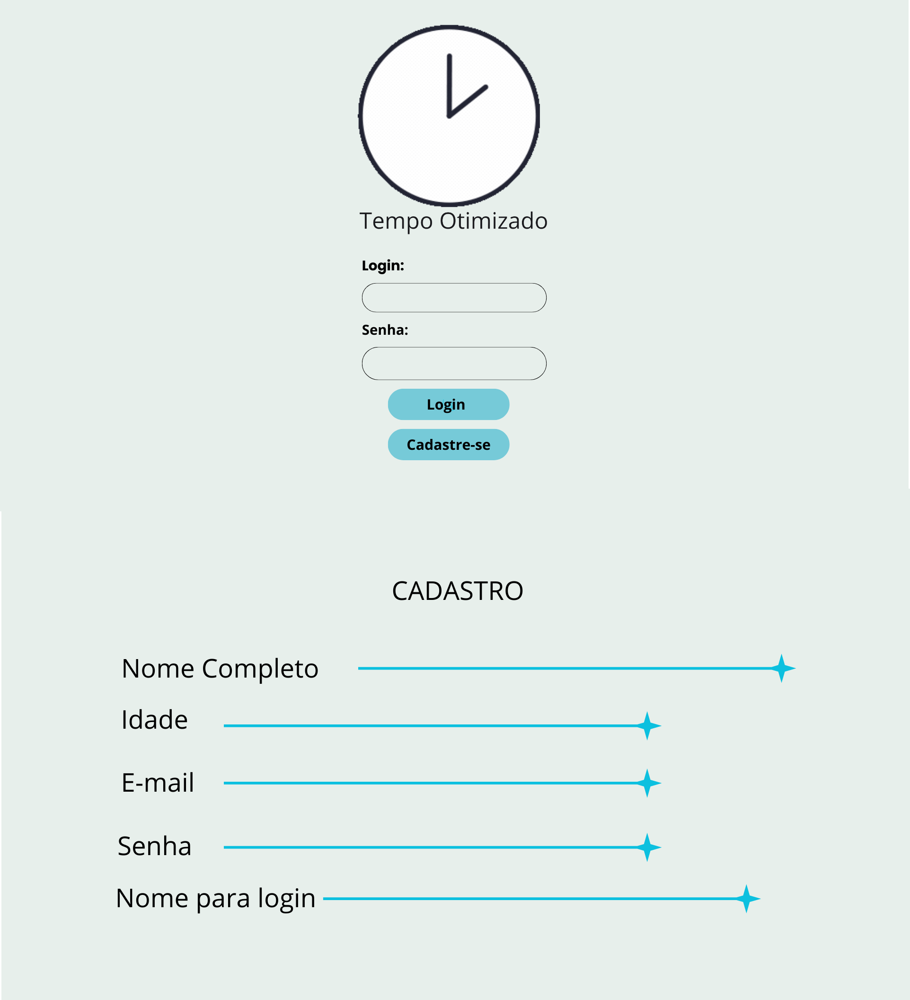

Página que permite o usuário entrar na sua conta ou se registrar caso não possua uma conta.
Possui um formulário simples para inserir os dados.

**Dashboard**

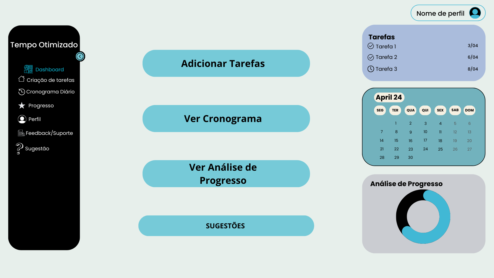

Página principal após login, que exibe as tarefas a serem concluídas, junto da opção de criar ou deletar tarefas.
Além disso, pode visualizar um calendário com as tarefas e uma breve preview da página de Análise.

**Cronograma**

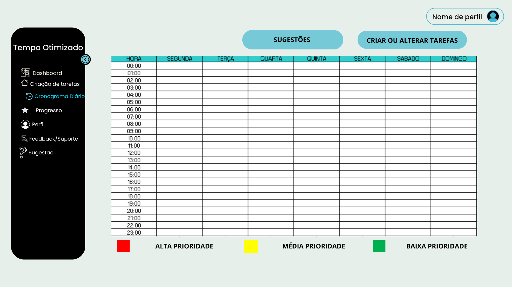

Página que exibe o cronograma de hora em hora dos dias da semana atual.
Possui uma legenda de cor por nível de prioridade das tarefas e um botão de atalho para a criação de tarefas,
página de sugestões e para inserir o horário em que o usuário dorme.

**Análise**

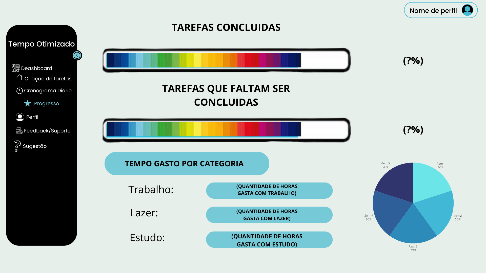

Exibe diversos gráficos e informações conforme a produtividade e o tempo gasto do usuário com as tarefas.

**Sugestões**

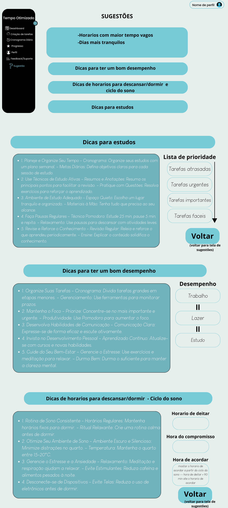

Página com listas de sugestões e dicas para o usuário com a opção de selecionar o tema.
Possui também um quadro de horários e dias mais vagos.

**Perfil**

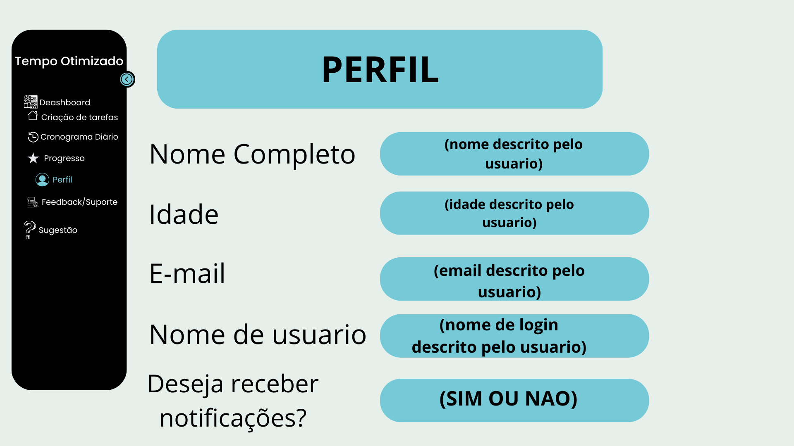

Página com as informações do perfil do usuário. Permitindo a opção de alterá-las ou deletar a conta.

### User Flow

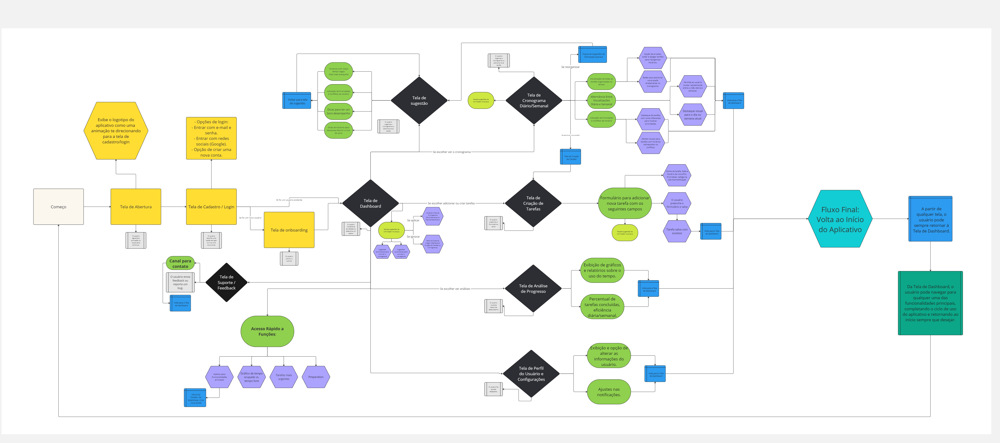

### Protótipo Interativo
Desenvolvemos wireframes para o layout da plataforma, chamada *“Tempo Otimizado”*, durante reuniões do grupo, com foco em gestão eficiente de tarefas e otimização do cronograma.

✅ [Tempo Otimizado - Figma](https://www.figma.com/design/IEsgUebiFZGQOkeAWqdyTZ/Untitled?node-id=0-1&node-type=canvas&t=ibNazsvTiTDXlugF-0)

# Metodologia

O desenvolvimento do projeto seguiu a metodologia SCRUM. Realizamos encontros semanais e utilizamos um grupo no WhatsApp para comunicação. Reuniões online foram realizadas para revisar o progresso e definir novas tarefas. A divisão de tarefas foi organizada utilizando a metodologia Kanban.

## Ferramentas

Relação de ferramentas empregadas pelo grupo durante o projeto.

| Ambiente                    | Plataforma | Link de acesso                                     |
| --------------------------- | ---------- | -------------------------------------------------- |
| Processo de Design Thinking | Miro       | [PPLCC-M - G5 - Dificuldade em otimizar o tempo](https://miro.com/app/board/uXjVKn9kuFg=/)        |
| Repositório de código       | GitHub     | [ti-1-ppl-cc-m-2024-2-g5-dificuldade-em-otimizacao-do-tempo](https://github.com/ICEI-PUC-Minas-PPLCC-TI/ti-1-ppl-cc-m-2024-2-g5-dificuldade-em-otimizacao-do-tempo) |
| Protótipo Interativo        | Figma      | [Tempo otimizado](https://www.figma.com/design/IEsgUebiFZGQOkeAWqdyTZ/Tempo-otimizado?node-id=0-1&node-type=canvas&t=I7xRj2ulRa4trN3M-0) |
| Documentação inicial        | Google Docs | [Documentação do projeto-G5 - Dificuldade em otimizar o tempo](https://docs.google.com/document/d/1Q8gyPVwmVyhmgnTF2TCXz3vqIcY56G-rgm00SgYForM/edit) |
| Comunicação e reunião       | Discord    |  |
| Listas e anotações          | DontPad    |  |

1) Miro - Utilizado para o Design Thinking, aproveitando do modelo já disponibilizado para nós. Possui uma diversidade de opções e permite a colaboração com a equipe e assim se tornando uma ótima opção

2) GitHub - O repositório Git mais conhecido e utilizado. Ótimo para a colaboração e versionamento dos projetos, podendo acompanhar o progresso e rapidamente encontrar erros.

3) Figma - Plataforma que não só auxilia na montagem do protótipo da interface, também nos traz opções de atribuir interatividade nos elementos da página. Assim, idealizar a função dos botões da página se torna rápido e prático.

4) Discord - Aplicativo de fácil acesso para mensagens de textos e de voz, permitindo que os membros da equipe se conecte para reuniões e a troca de ideias.

5) DontPad - Um bloco de notas que pode ser editado e enviado para os outros rapidamente. Por não precisar de login, as anotações são passadas rapidamente entre os integrantes do grupo.

6) Google Docs - Antes da documentação ser passada ao GitHub em formato Markdown, a documentação estava inicialmente sendo feita no Google Docs, que permite o compartilhamento e a edição entre o grupo, além de haver diversas opções para a formatação do texto.

## Gerenciamento do Projeto

Divisão de papéis no grupo e apresentação da estrutura da ferramenta de controle de tarefas (Kanban).

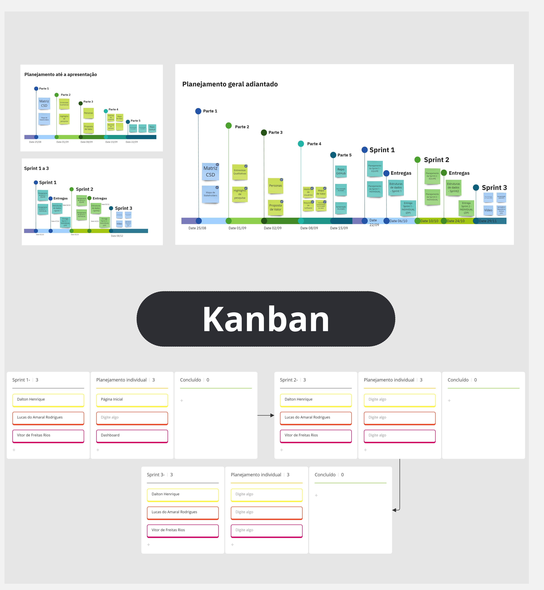

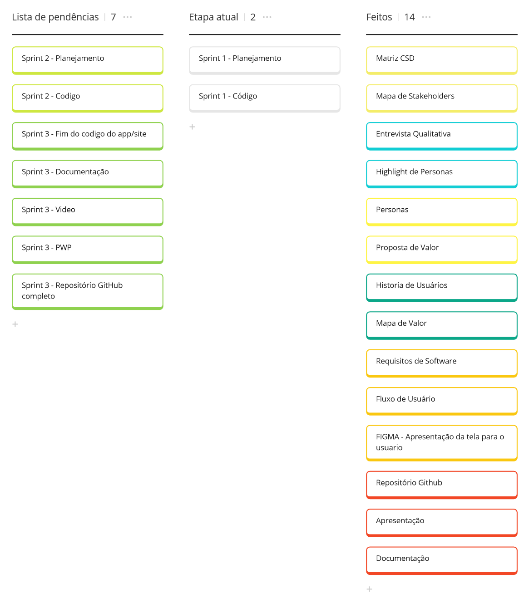

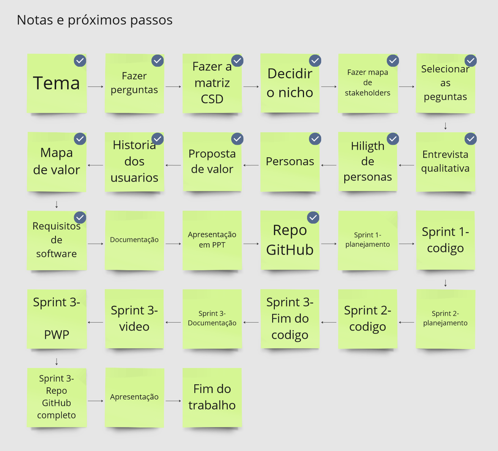

