# **Tempo Otimizado**

## **Menu de Navegação**

A documentação do projeto é estruturada da seguinte forma:

| **Links**                                        |                                      |
| :----------------------------------------------- | :----------------------------------- |
| - [Menu](#menu)                                  | - [Requisitos](#requisitos)          |
| - [Contexto](#contexto)                          | - [Ações do Usuário](#acoes)         |
| - [Projeto de Design thinking](#design-thinking) | - [Projeto de Interfaces](#projetos) |
| - [Personas](#personas)                          | - [Metodologia](#metodologia)        |
| - [Introdução](#introducao)                      | - [Como usar](#iniciar)              |

## **Introdução**

Informações básicas do projeto.

- **Projeto:** Tempo otimizado
- **Repositório GitHub:** [ti-1-ppl-cc-m-2024-2-g5-dificuldade-em-otimizacao-do-tempo ](https://github.com/ICEI-PUC-Minas-PPLCC-TI/ti-1-ppl-cc-m-2024-2-g5-dificuldade-em-otimizacao-do-tempo)
- **Repositório GitHub Pessoal**: [Trabalho-TI-1-puc-minas](https://github.com/Vitorfrios/Trabalho-TI-1-puc-minas)

- **Membros da equipe:**
  - [Vitor de Freitas Rios](https://github.com/Vitorfrios)

### Documentos:
| ✅ [Telas do projeto](codigo\README.md) | [✅ Código do projeto](https://github.com/Vitorfrios/Trabalho-TI-1-puc-minas/raw/main/docs/files/Trabalho-TI-1-puc-minas.zip)
 | ✅ [Documentação de Design Thinking (MIRO)](/docs/files/processo-dt-G5.pdf) |

## **Contexto**

Em um mundo cada vez mais dinâmico e digitalizado, muitas pessoas enfrentam dificuldades para otimizar seu tempo. Isso ocorre devido à sobrecarga de tarefas, falta de planejamento adequado e a constante presença de distrações. Nos últimos anos, a fácil acessibilidade a dispositivos eletrônicos tem exacerbado esse problema, uma vez que eles oferecem uma infinidade de distrações, tornando a gestão do tempo ainda mais desafiadora. Como resultado, muitos indivíduos experimentam atrasos em suas rotinas diárias e uma sensação geral de improdutividade. Por isso, torna-se essencial adotar métodos eficazes para gerenciar o tempo, priorizar atividades e encontrar um equilíbrio saudável entre o trabalho e o lazer.

### **Problema**

- **Dificuldade em gerenciar o tempo:** Muitos indivíduos têm dificuldade em organizar suas tarefas e prioridades, o que pode resultar em perda de produtividade e acúmulo de responsabilidades.
- **Impacto na qualidade de vida:** A falta de estratégias eficazes para otimizar o tempo pode gerar estresse, esgotamento e uma sensação constante de sobrecarga, afetando negativamente a qualidade de vida.
- **Dificuldade de acesso a ferramentas adequadas:** Existe uma grande dificuldade em encontrar métodos e ferramentas acessíveis e confiáveis para melhorar a gestão do tempo de maneira prática.
- **Sobrecarga de responsabilidades:** O excesso de tarefas e a falta de organização geram longas listas de afazeres, o que aumenta o tempo necessário para concluir atividades importantes.

### **Objetivos**

- **Facilitar a otimização do tempo:** Criar uma plataforma online que ajude os usuários a organizar e gerenciar melhor seu tempo, conectando-os a ferramentas e estratégias eficazes de produtividade.
- **Reduzir as dificuldades no aproveitamento do tempo:** A plataforma deve oferecer uma maneira prática e acessível para que os usuários identifiquem suas prioridades, planejem suas atividades e alcancem um equilíbrio entre trabalho e vida pessoal.
- **Promover um estilo de vida mais saudável:** Com uma boa gestão do tempo, será possível reduzir a procrastinação, garantir uma rotina mais ativa e produtiva, evitando estresse e esgotamento, ao mesmo tempo em que se mantém tempo para hobbies e interesses pessoais.

### **Justificativa**

- **Impacto positivo na produtividade:** Ao facilitar o acesso a ferramentas de gestão de tempo, podemos ajudar os usuários a aumentar sua eficiência, reduzir o estresse e melhorar a qualidade de vida.
- **Redução da procrastinação:** A procrastinação afeta cerca de 20% dos adultos no Brasil. A otimização do tempo pode ser uma solução eficaz para reduzir esse comportamento e promover uma vida mais produtiva e saudável.
- **Proximidade com a problemática:** Todos os integrantes do grupo podem se relacionar diretamente com a dificuldade em gerenciar o tempo, uma vez que todos são estudantes universitários com rotinas intensas e múltiplos compromissos.

### **Proposta de Solução**

A solução proposta consiste no desenvolvimento de uma plataforma digital que reúne um conjunto de ferramentas voltadas para a organização, gestão e otimização do tempo. Esta plataforma será projetada para se adaptar às necessidades de diferentes perfis de usuários, oferecendo funcionalidades como:

- **Gestão de Tarefas:** O usuário poderá criar e organizar suas tarefas de forma centralizada, definindo prazos, prioridades e categorias, além de poder acompanhar o progresso de suas atividades.
- **Calendário e Planejamento:** A plataforma contará com um calendário interativo para que os usuários visualizem suas tarefas, compromissos e horários vagos, facilitando o gerenciamento de seu dia a dia.
- **Ferramentas de Produtividade:** Métodos como o _Pomodoro_ serão integrados à plataforma, ajudando os usuários a trabalhar de maneira mais eficiente, com intervalos estratégicos para descanso e recuperação.
- **Relatórios de Desempenho:** A plataforma gerará relatórios semanais e mensais, mostrando o tempo gasto por tarefa, para que os usuários possam analisar seu desempenho e identificar áreas para melhoria.
- **Ferramentas para Redução de Distrações:** Serão integrados aplicativos que bloqueiam sites e notificações para ajudar os usuários a manter o foco em suas tarefas e reduzir distrações externas.

A plataforma será intuitiva e de fácil acesso, com uma interface amigável, adequada tanto para iniciantes quanto para usuários mais experientes em gestão de tempo. Ela será acessível em dispositivos móveis e desktops, permitindo que os usuários possam gerenciar suas atividades de qualquer lugar.

O objetivo final é não apenas melhorar a produtividade dos usuários, mas também contribuir para sua saúde mental e bem-estar, proporcionando mais tempo livre para lazer e descanso. A longo prazo, esperamos que os usuários consigam estabelecer um equilíbrio saudável entre suas responsabilidades pessoais e profissionais, o que impactará positivamente sua qualidade de vida.

### **Público-Alvo**

Nosso público-alvo principal são jovens adultos e adultos, entre 20 e 50 anos, com rotinas intensas e carregadas, como estudantes universitários, estagiários, professores, coordenadores e outros profissionais. A maioria desse público tem acesso à tecnologia, que tanto pode ser uma ferramenta útil quanto uma fonte de distração. Nosso foco inclui:

- **Profissionais e estudantes:** Aqueles que precisam organizar suas rotinas e maximizar seu tempo de forma eficaz.
- **Indivíduos que buscam melhorar sua produtividade:** Pessoas que desejam otimizar seu tempo para aumentar a eficiência e reduzir o estresse.
- **Empresas, educadores e outros influenciadores:** Organizações que apoiam a gestão eficaz do tempo e a produtividade dos seus colaboradores ou estudantes.

## **Projeto de Design Thinking**

| **Matriz CSD e Mapa de Stakeholders**                                    | **Entrevista Qualitativa**                                       | **Histórias de Usuários**                           |
| ------------------------------------------------------------------------ | ---------------------------------------------------------------- | --------------------------------------------------- |
|  | 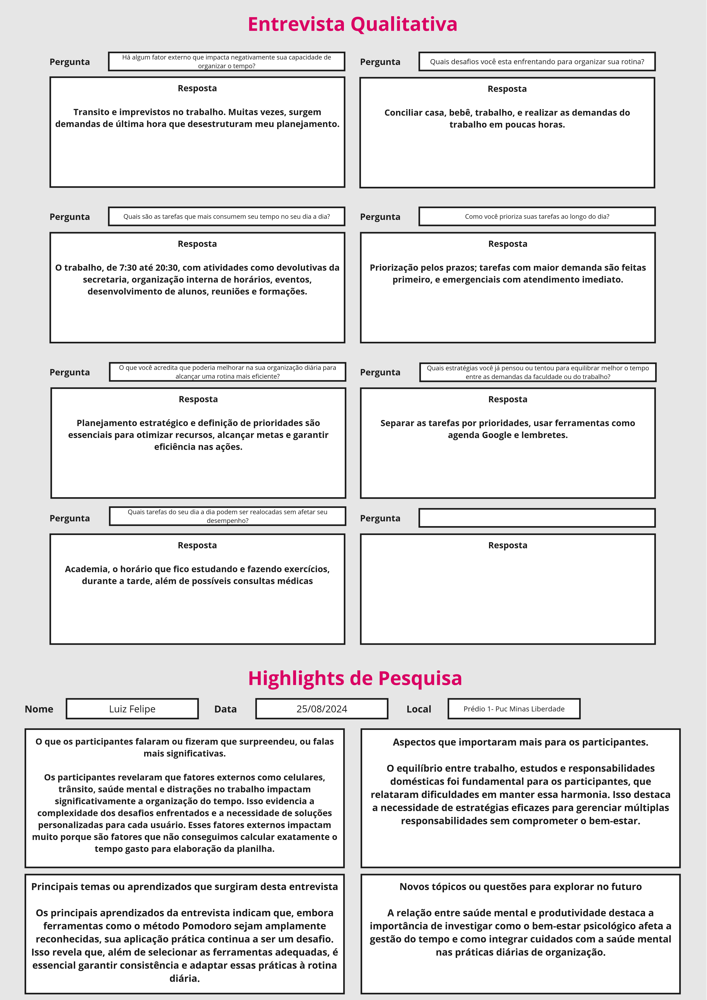 | 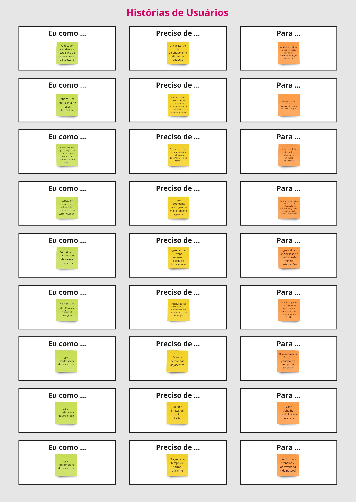 |

| **Brainstorming / Brainwriting**                               | **Mural de Possibilidades**                                         | **Priorização de Ideias**                                   |
| -------------------------------------------------------------- | ------------------------------------------------------------------- | ----------------------------------------------------------- |
| 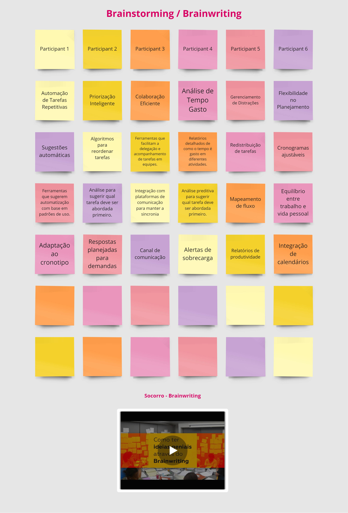 | 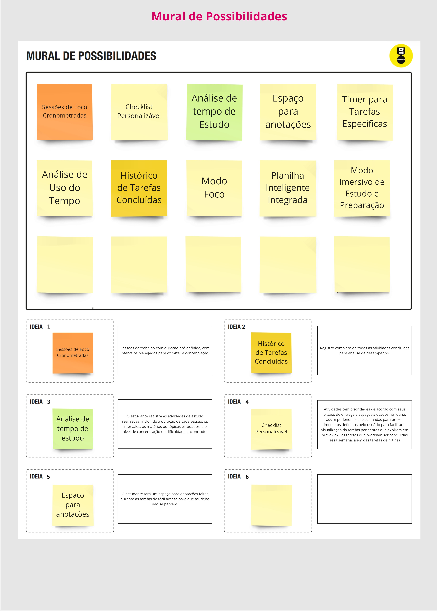 | 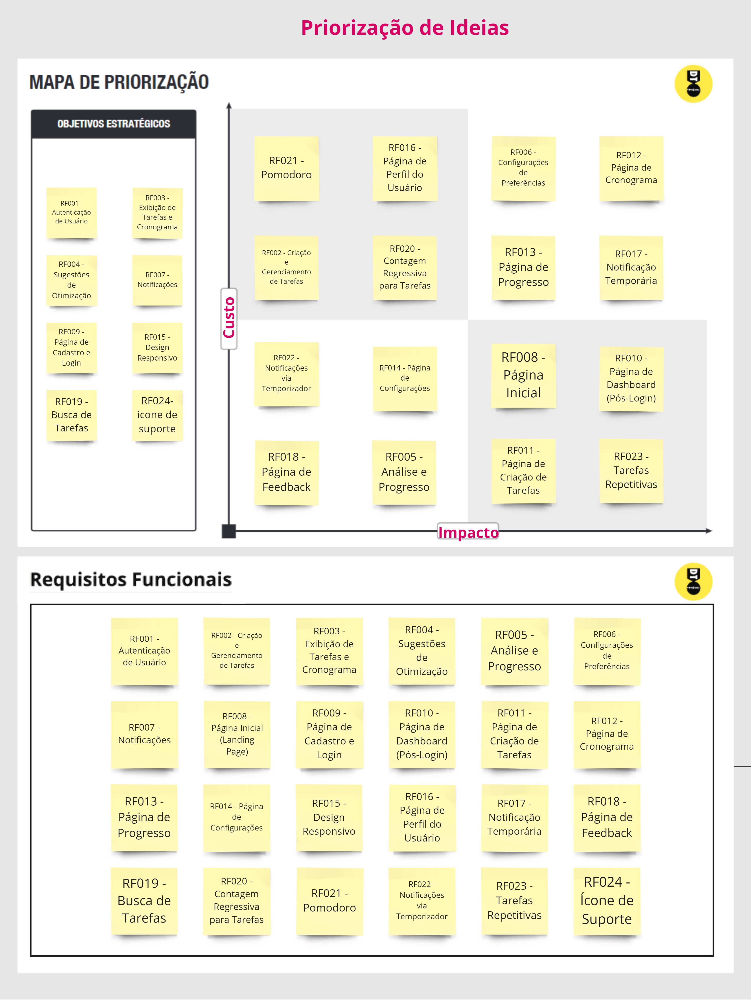 |

### **Fluxo de Usuários**

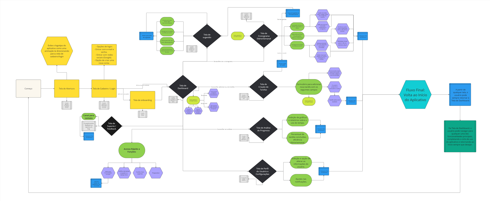

## **Personas**

|                **André Albuquerque**                |                **Aline Maia**                |                **Carlos Mendonça**                 |
| :-------------------------------------------------: | :------------------------------------------: | :------------------------------------------------: |
|  | 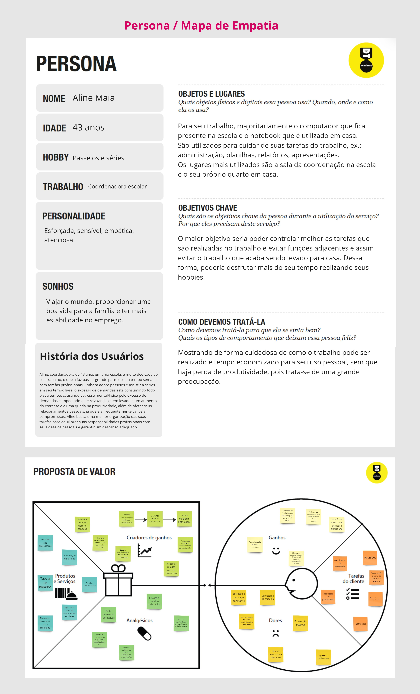 | 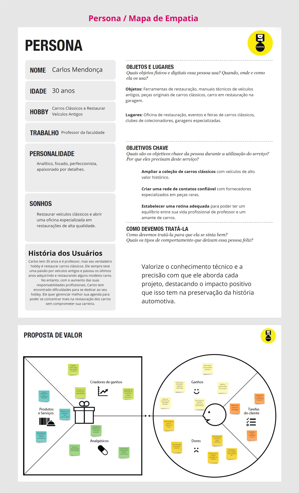 |

## **Requisitos**

As tabelas a seguir apresentam os requisitos funcionais e não funcionais detalhados para o escopo do projeto.

### **Requisitos Funcionais e Não Funcionais**

| **_Tela_**                                 | **_Requisitos Funcionais (RF)_**                                                                                                                                    | **_Requisitos Não Funcionais (RNF)_**                                                                                                               |
| ------------------------------------------ | ------------------------------------------------------------------------------------------------------------------------------------------------------------------- | --------------------------------------------------------------------------------------------------------------------------------------------------- |
| **_1. Tela de Abertura_**                  | - Exibir o logotipo com animação - Exibir botão para avançar à tela de cadastro/login ou redirecionar automaticamente após a animação.                           | - Animação com tempo de 2-3 segundos - Design responsivo - Transições suaves entre telas.                                                     |
| **_2. Tela de Cadastro/Login_**            | - Login com e-mail e senha - Opção de cadastro para novos usuários - Links para recuperação de senha e alternar entre cadastro/login - Login com Google.   | - Segurança dos dados (senhas criptografadas) - Resposta do sistema em < 2 segundos - Design acessível e legível.                             |
| **_3. Tela de Tutorial_**                  | - Exibir slides sobre o aplicativo - Navegar entre slides com botões - Opção de pular o Tutorial - Registrar se o usuário completou o Tutorial.            | - Processo de Tutorial em 2-3 minutos - Textos e gráficos simples e claros - Compatível com dispositivos móveis e desktops.                   |
| **_4. Tela de Dashboard_**                 | - Exibir tarefas do dia/semana - Atalhos para “Criar Tarefa”, “Sugestão” e “Cronograma semanal” - Atualização em tempo real.                                  | - Carregamento rápido das tarefas - Design responsivo - Suportar grande quantidade de tarefas sem perda de desempenho.                        |
| **_5. Tela de Cronograma Diário/Semanal_** | - Exibir tarefas organizadas no cronograma - Permitir arrastar e reorganizar tarefas - Botão para adicionar nova tarefa.                                      | - Transição rápida e sem travamentos - Layout responsivo - Reorganização de tarefas salva imediatamente.                                      |
| **_6. Tela de Criação de Tarefas_**        | - Formulário para criar/editar tarefas - Campos obrigatórios: nome, data/hora, prioridade, categoria e notificação - Salvar tarefa e adicionar ao cronograma. | - Validação dos campos em tempo real - Design intuitivo e responsivo - Salvamento em < 1 segundo.                                             |
| **_7. Tela de Sugestão_**                  | - Exibir três tipos de sugestões:  1. Dicas para estudo  2. Dicas para descansar/dormir  3. Dicas para bom desempenho.                                     | - Sugestões claras e interativas - Análise rápida e baseada em dados reais - Layout compatível com dispositivos móveis e desktops.            |
| **_8. Tela de Perfil_**                    | - Permite editar informações pessoais:  Nome completo Idade Email Nome de usuário  - Configurações de preferências, como notificações.               | - Design simples e acessível - Alteração dos dados do perfil incluindo senha - Configuração de notificações para manter o usuário atualizado. |
| **_9. Tela de Suporte/Feedback_**          | - Formulário para feedback e suporte - Campos obrigatórios: descrição e categoria - Envio do formulário e confirmação de recebimento.                         | - Resposta para envio do formulário em < 2 segundos - Design simples e acessível - Feedback registrado de forma segura e confidencial.        |

## **Ações do Usuário**

As ações que o usuário pode realizar em cada tela do sistema são descritas na tabela a seguir.

| **_Tela_**                                 | **_Ações do Usuário_**                                                                                                                                                                                                                           |
| ------------------------------------------ | ------------------------------------------------------------------------------------------------------------------------------------------------------------------------------------------------------------------------------------------------ |
| **_1. Tela de Abertura_**                  | - Observar a animação do logotipo - Clicar no botão para prosseguir, caso não redirecionado automaticamente                                                                                                                                   |
| **_2. Tela de Cadastro/Login_**            | - Inserir e-mail e senha para login - Clicar na opção de cadastro - Alternar entre login e cadastro - Utilizar a opção de login com Google                                                                                              |
| **_3. Tela de Tutorial_**                  | - Navegar entre os slides - Pular o Tutorial, se desejado - Receber informações sobre o aplicativo                                                                                                                                         |
| **_4. Tela de Dashboard_**                 | - Menu de navegação com 4 opções - Área de mostragem de tarefas - Clicar no calendário para exibir as tarefas - Exibir gráfico com base no tempo gasto em cada categoria                                                                |
| **_5. Tela de Cronograma Diário/Semanal_** | - Visualizar tarefas durante um período de 7 dias - Filtrar semana do mês: Selecionar a semana desejada para visualizar - Ver sugestões/dicas: Ir para a página de sugestões - Adicionar tarefa: Ir para a página de criação de tarefas |
| **_6. Tela de Criação de Tarefas_**        | - Escrever o nome da tarefa - Escolher os dias de repetição da tarefa (se necessário) - Escolher a hora, o dia e a prioridade da tarefa - Escolher as categorias (lazer/trabalho/estudo) - Exibir tarefas no calendário e gráfico    |
| **_7. Tela de Sugestão_**                  | - Menu de navegação com 3 opções:   - Ajuda com horários   - Dicas de estudo   - Dicas para descansar                                                                                                                                   |
| **_7.1 Dicas para Estudo_**                | - Clicar na roleta para exibir as 4 dicas - Técnicas de estudo - Organizar o tempo de estudo - **Técnica Pomodoro**: Divida o tempo de estudo em intervalos de 25 minutos, seguidos de 5 minutos de pausa. Após quatro ciclos, faça uma pausa maior de 15-30 minutos. Isso ajuda a melhorar o foco e a produtividade, evitando a sobrecarga mental.                                                                                                                                                        |                                                   |
| **_7.2 Dicas para Dormir_**                | - Clicar na roleta para exibir as 4 dicas - Calcular o horário de dormir e acordar - Digitar o horário de deitar - Digitar o horário do compromisso - Exibir a hora de acordar e o tempo de sono                                     |
| **_7.3 Dicas para Ter um Bom Desempenho_** | - Clicar na roleta para exibir as 4 dicas - Mostrar a quantidade de tarefas por categoria - Mostrar a quantidade de horas gastas por categoria                                                                                             |
| **_8. Tela de Perfil do Usuário_**         | - Editar nome completo - Editar idade - Editar e-mail - Editar nome de usuário                                                                                                                                                          |
| **_9. Tela de Suporte/Feedback_**          | - Preencher e enviar o formulário de feedback/suporte - Aguardar a confirmação de recebimento - Enviar feedback - Obter ajuda com o aplicativo                                                                                          |

## **Projeto de Interface**

Artefatos relacionados com a interface e a interacão do usuário na proposta de solução.

### **Protótipo Interativo**

Desenvolvemos wireframes para o layout da plataforma, chamada _“Tempo Otimizado”_, durante reuniões do grupo, com foco em gestão eficiente de tarefas e otimização do cronograma.

✅ [Tempo Otimizado - Figma](https://www.figma.com/design/IEsgUebiFZGQOkeAWqdyTZ/Untitled?node-id=0-1&node-type=canvas&t=ibNazsvTiTDXlugF-0)

### **Wireframes**

Estes são os protótipos de telas do sistema.

|           **Título**           |                                **Imagem**                                 | **Descrição**                                                                                                                                                                                                                                              |
| :----------------------------: | :-----------------------------------------------------------------------: | :--------------------------------------------------------------------------------------------------------------------------------------------------------------------------------------------------------------------------------------------------------- |
|       **Página Inicial**       |   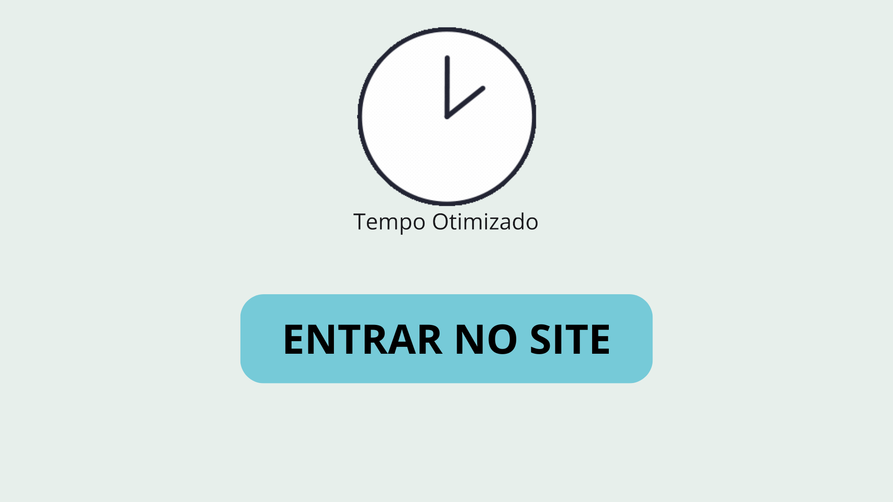   | Página inicial da plataforma, onde o usuário poderá ler sobre o projeto e acessar a página de acesso à conta.                                                                                                                                              |
| **Página de Login e Registro** | 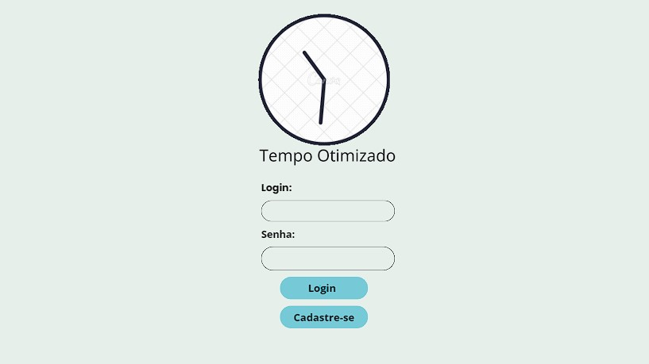 | Página que permite o usuário entrar na sua conta ou se registrar caso não possua uma conta. Possui um formulário simples para inserir os dados.                                                                                                            |
|          **Tutorial**          |        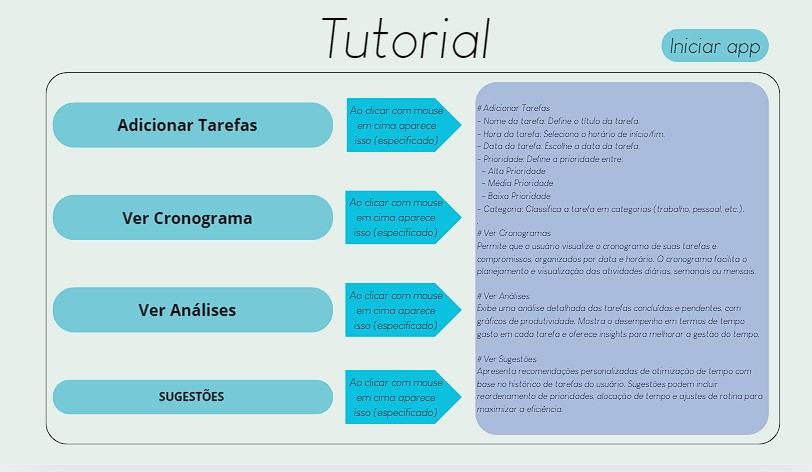         | Página que apresenta um guia interativo para os novos usuários, com explicações detalhadas sobre as funcionalidades do sistema, permitindo navegação entre os slides ou a opção de pular o tutorial.                                                       |
|         **Dashboard**          |       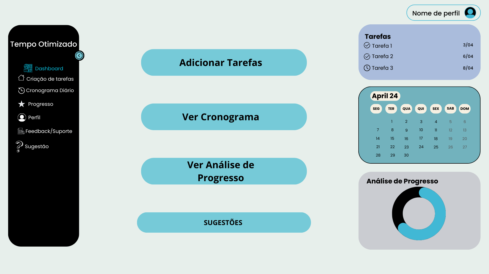        | Página principal após login, que exibe as tarefas a serem concluídas, junto da opção de criar ou deletar tarefas. Além disso, pode visualizar um calendário com as tarefas e uma breve preview da página de Análise.                                       |
|         **Cronograma**         |      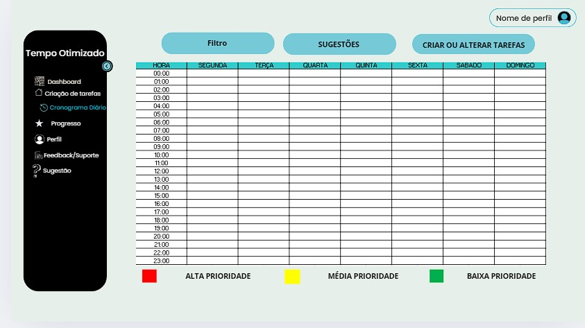       | Página que exibe o cronograma de hora em hora dos dias da semana atual. Possui uma legenda de cor por nível de prioridade das tarefas e um botão de atalho para a criação de tarefas, página de sugestões e para inserir o horário em que o usuário dorme. |
|     **Criação de Tarefas**     |    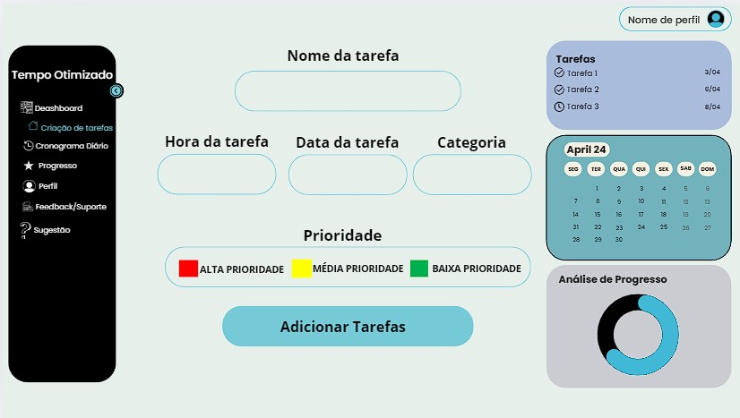    | Página dedicada à criação de tarefas. Permite ao usuário adicionar detalhes como nome, data/hora, prioridade e categoria. Também oferece a opção de definir notificações e criar tarefas recorrentes.                                                      |
|         **Sugestões**          |   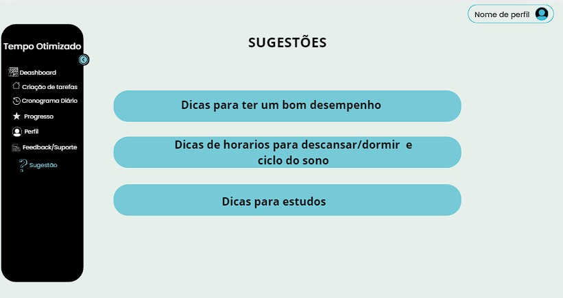    | Página com listas de sugestões e dicas para o usuário com a opção de selecionar o tema. Possui também um quadro de horários e dias mais vagos.                                                                                                             |
|     **Dicas para Estudo**      |     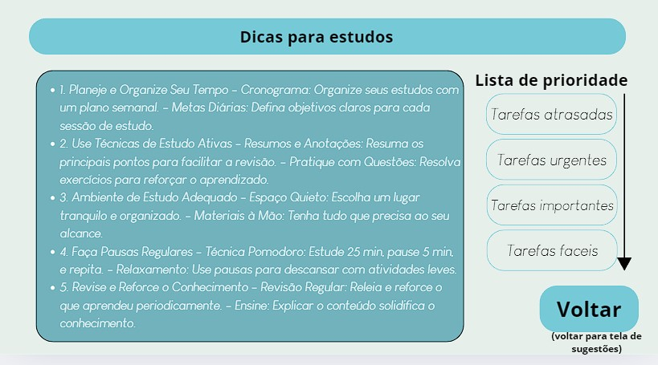     | Página dedicada a oferecer técnicas de estudo, como o método Pomodoro e uma roleta interativa com dias para ajudandar o usuário a organizar seu tempo de forma eficiente.                                                                                                        |
|    **Dicas para Descansar**    |   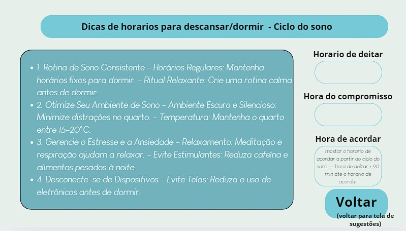    | Página voltada ao bem-estar do usuário, com orientações sobre hábitos de sono saudáveis, cálculo de ciclos de sono e horários ideais para dormir e acordar, promovendo um descanso mais eficiente.                                                         |
|    **Dicas de Desempenho**     |  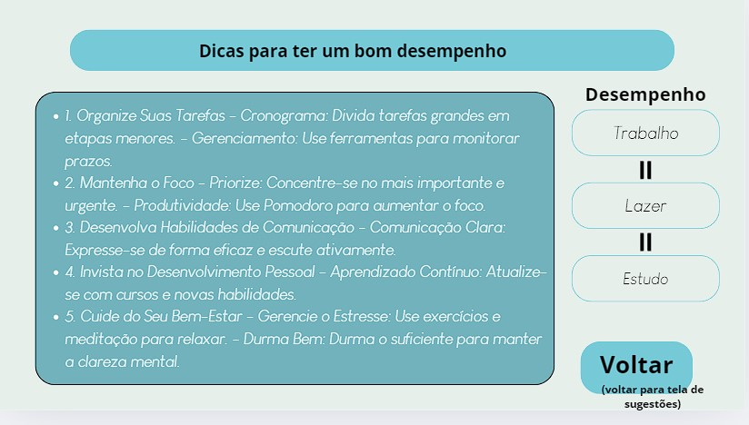  | Página que fornece sugestões para melhorar a produtividade, como técnicas de organização, foco em metas e priorização de tarefas, com base no desempenho atual e nos hábitos do usuário.                                                                   |
|           **Perfil**           |          | Página com as informações do perfil do usuário. Permitindo a opção de alterá-las ou deletar a conta.                                                                                                                                                       |
|      **Suporte/Feedback**      | 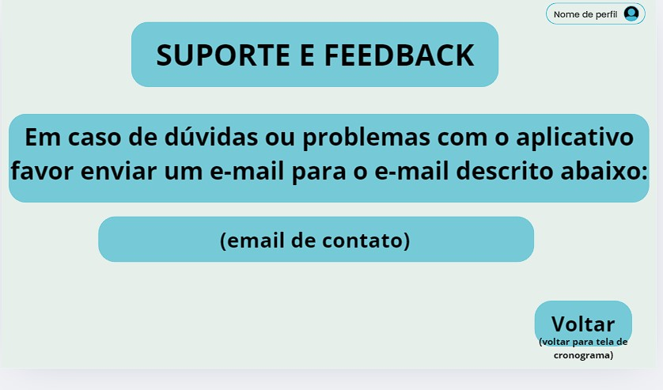 | Página destinada ao envio de dúvidas, sugestões ou relatórios de problemas. Oferece um formulário simples e eficiente, com campos obrigatórios para categoria e descrição, além de confirmação de recebimento.                                             |

## **Metodologia**

O desenvolvimento do projeto seguiu a metodologia SCRUM. Realizamos encontros semanais e utilizamos um grupo no WhatsApp para comunicação. Reuniões online foram realizadas para revisar o progresso e definir novas tarefas. A divisão de tarefas foi organizada utilizando a metodologia Kanban.

### **Ferramentas**

Relação de ferramentas empregadas pelo grupo durante o projeto.

| **Item**                     | **Plataforma** | **Link**                                                                                                                                                                  |
|------------------------------|----------------|---------------------------------------------------------------------------------------------------------------------------------------------------------------------------|
| Processo de Design Thinking   | Miro           | [PPLCC-M - G5 - Dificuldade em otimizar o tempo](https://miro.com/app/board/uXjVKn9kuFg=/)                                                                                |
| Repositório de código PUC     | GitHub         | [ti-1-ppl-cc-m-2024-2-g5-dificuldade-em-otimizacao-do-tempo](https://github.com/ICEI-PUC-Minas-PPLCC-TI/ti-1-ppl-cc-m-2024-2-g5-dificuldade-em-otimizacao-do-tempo)          |
| Repositório de código Pessoal | GitHub         | [Trabalho-TI-1-puc-minas](https://github.com/Vitorfrios/Trabalho-TI-1-puc-minas)                                                                                        |
| Protótipo Interativo          | Figma          | [Tempo otimizado](https://www.figma.com/design/IEsgUebiFZGQOkeAWqdyTZ/Tempo-otimizado?node-id=0-1&node-type=canvas&t=I7xRj2ulRa4trN3M-0)                                |
| Documentação inicial          | Google/Docs    | [Documentação do projeto-G5 - Dificuldade em otimizar o tempo](https:///docs.google.com/document/d/1Q8gyPVwmVyhmgnTF2TCXz3vqIcY56G-rgm00SgYForM/edit)                   |
| Comunicação e reunião         | Discord        |                                                                                                                                                                           |
| Listas e anotações            | DontPad        |                                                                                                                                                                           |

**Miro**  -  Utilizado para o Design Thinking, aproveitando o modelo já disponibilizado para nós. Possui uma diversidade de opções e permite a colaboração com a equipe, tornando-se uma ótima opção.

**GitHub**  -  O repositório Git mais conhecido e utilizado. Ótimo para colaboração e versionamento dos projetos, permitindo acompanhar o progresso e rapidamente encontrar erros.

**Figma**  -  Plataforma que não só auxilia na montagem do protótipo da interface, mas também traz opções de atribuir interatividade aos elementos da página. Assim, idealizar a função dos botões da página se torna rápido e prático.

**Discord**  -  Aplicativo de fácil acesso para mensagens de texto e voz, permitindo que os membros da equipe se conectem para reuniões e trocas de ideias.

**DontPad**  -  Um bloco de notas que pode ser editado e enviado para os outros rapidamente. Por não precisar de login, as anotações são passadas rapidamente entre os integrantes do grupo.

**Google Docs**  -  Antes da documentação ser passada ao GitHub em formato Markdown, ela era feita inicialmente no Google Docs, que permite o compartilhamento e edição entre o grupo, além de diversas opções para formatação do texto.

### **Gerenciamento do Projeto**

Divisão de papéis no grupo e apresentação da estrutura da ferramenta de controle de tarefas (Kanban).

|            **Kanban**             |               **Planejamento das Sprints**                |            **Notas e próximos passos**            |
| :-------------------------------: | :-------------------------------------------------------: | :-----------------------------------------------: |
| 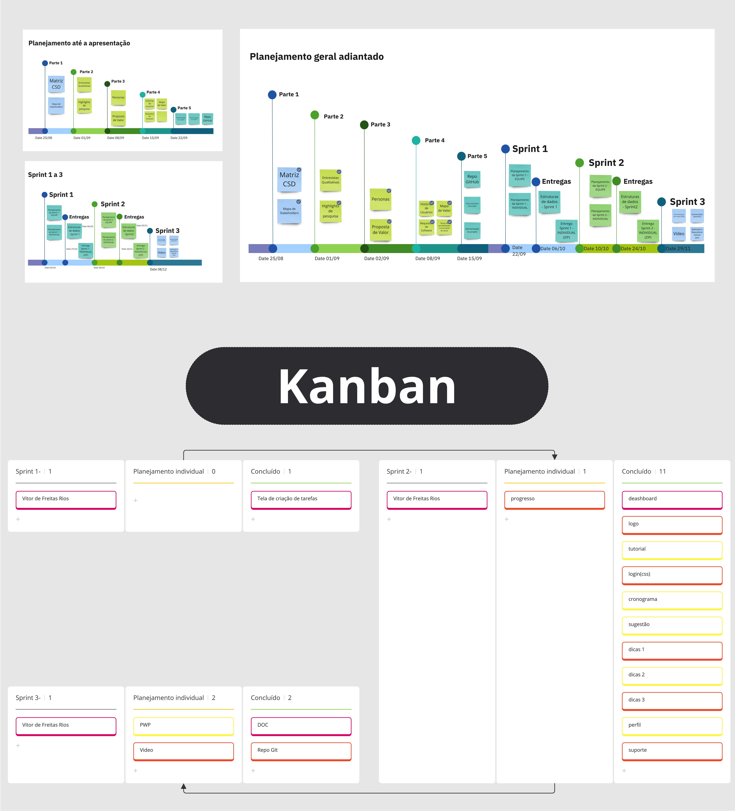 | 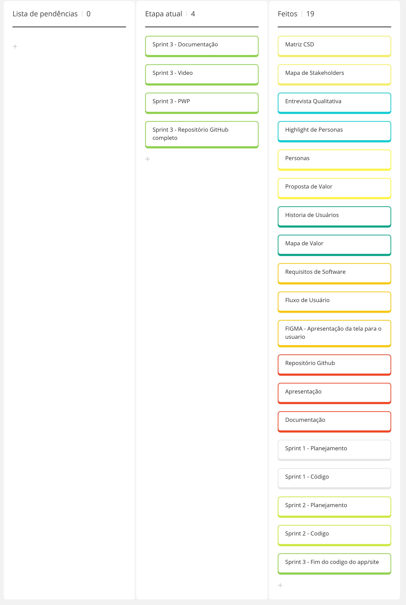 | 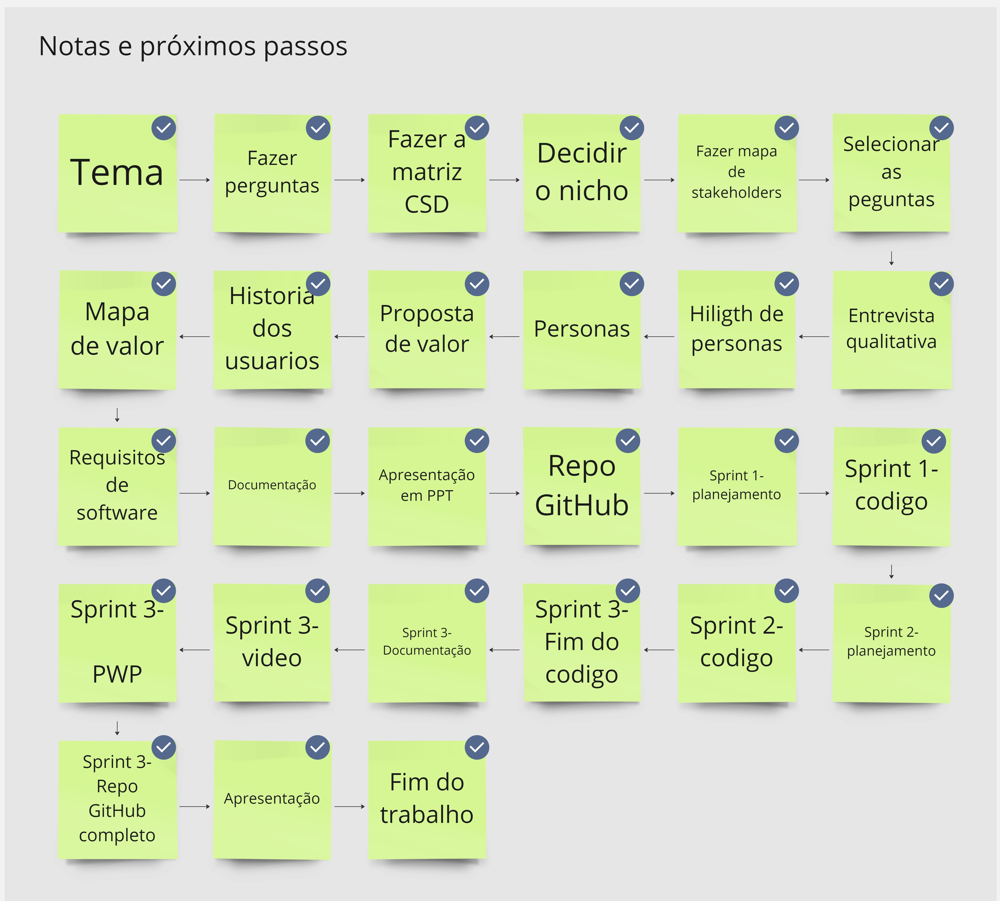 |

---

## **Como usar o app**

### Sistema de Otimização de tempo

Este sistema web foi desenvolvido para oferecer uma solução completa de organização e produtividade. Ele possibilita o gerenciamento de tarefas, acompanhamento de progresso e sugestões para melhoria pessoal.

---

### Estrutura do Projeto

A estrutura do projeto está organizada em pastas para facilitar a compreensão e o desenvolvimento.

### Diretórios Principais

- **/assets**: Contém arquivos estáticos.
  - **/css**: Arquivos de estilo que definem a aparência das páginas.
  - **/images**: Imagens utilizadas no design da interface.
  - **/js**: Scripts que adicionam funcionalidades dinâmicas ao sistema.
- **/pages**: Páginas HTML que compõem o sistema.

---

### Como Executar o Projeto

- DIGITE " npm start " no terminal
- Vá para o arquivo " about.html " e acione o live server
- Leia sobre o projeto e inicie o app clicando no botao " Iniciar App "
- Caso queira saber mais sobre o projeto clique em " Ver Informações ", você será encaminhado a uma pagina que contém todas as telas funcionando, entretanto em miniatura
